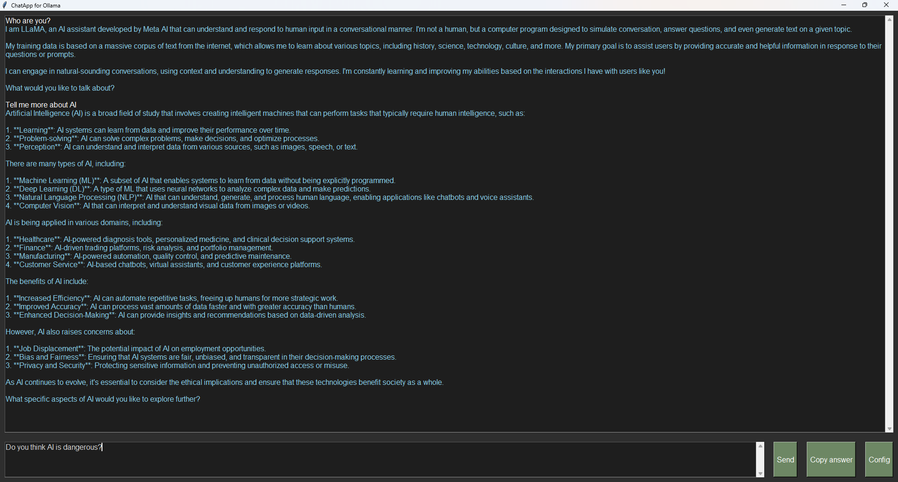

# Tkinter based Ollama GUI

This project provides a minimalistic Python-tkinter based GUI application for interacting with local LLMs via [Ollama](https://github.com/ollama/ollama) as well as Python classes for programmatically accessing the [Ollama API](https://github.com/ollama/ollama/blob/main/docs/api.md) to create code-based applications that interact with local LLMs. The implementation is "pure" Python, so no additional packages need to be installed that are not already shipped with Python. 

The project was motivated by experiments with local LLMs within my companies highly restricted network, where access to external tools and libraries is very limited. 

**Note:** There are more sophisticated and mature utilities for interacting with Ollama and providing GUIs. E.g. checkout the GUI [OpenWebUI](https://openwebui.com/), Ollama's [own](https://github.com/ollama/ollama-python) Python API client, or Langchain's Chat and Langchains [Ollama](https://api.python.langchain.com/en/latest/llms/langchain_community.llms.ollama.Ollama.html) and [OllamaChat](https://api.python.langchain.com/en/latest/chat_models/langchain_community.chat_models.ollama.ChatOllama.html) Classes. However since all these solutions include the installation of external software and python packages they were not suitable in my case.
 
## Features
### GUI

- **Chat Interface**: Send messages to an Ollama model and receive responses.
- **Configurable Models**: Select from available Ollama models directly from the GUI.
- **Copy Responses**: Easily copy the last response to the clipboard.

**Note - Response Delays**: Please note that there might be a delay after submitting a message as computing the LLM resposne can be time consuming. 

## Project structure
- **ChatApp.py** utilizes tkinter to create a user-friendly interface. It includes features like sending messages, displaying responses, and managing configurations.
- **Ollama.py** handles communication with Ollama's web server via HTTP requests. It provides methods for generating responses and managing available models.
- **start_gui.bat** is provided for convenience but requires manual configuration of the Python executable path (`pythonw.exe`).

## Setup/Installation
1. Ensure Ollama and Python 3.x (including tkinter and requests) are installed on your system.
2. Clone the repository: `git clone https://github.com/<your_username>/OllamTkinterGUI.git`
3. Navigate into the directory: `cd OllamTkinterGUI`
4. Run the application using the batch script:
   - Open `OllamaGUI.bat` in a text editor.
   - Set the `PYTHON_PATH` variable to point to your `pythonw.exe` executable.
   - Save the file and double-click `start_gui.bat` to launch the GUI.
5. Alternatively, run the application directly: `python ChatApp.py`

## Requirements
- Python 3.x
  - tkinter library (typically included in standard Python installations)
  - requests library
- Ollama

## License
see LICENSE file